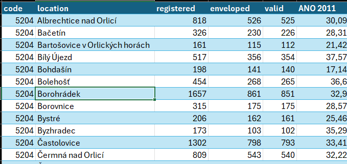

Třetí projekt od ENGETO

**POPIS PROJEKTU**

Skript umí extrahovat data z webové strany z výsledku parlamentních voleb pro rok 2017, které následně vyexportuje do .csv souboru. V souboru naleznete výsledky hlasování a to v pořádí:
* Kód obce
* Název obce
* Počet registrovaných voličů
* Počet vydaných hlasovacích obálek
* Počet platných hlasů
* Jednotlivé kandidující strany

**INSTALACE KNIHOVEN**

 Pro správnou funkčnost celého skriptu je nutné instalaci knihoven. V příloženom soubour **requirements.txt** Doporučuji použít nové virtuální prostřední a nainstalovanými knihovnami opětovně spustit
 
    pip3 --version                          #ověření verze manažera
    pip3 install -r requirements.txt        #instalace knihoven

**UKÁZKA PROJEKTU**

Výsledky hlasování pro okres Rychnov nad Kněžnou 

1. argument: https://volby.cz/pls/ps2017nss/
2. argument: "vysledky_hlasovani_rychnov.csv"

**SPOUŠTĚNÍ PROJEKTU**

Samotný skript se spouští přes příkazový řádek s 2 povinnými argumenty

        python election_scraper.py "https://volby.cz/pls/ps2017nss/" "vysledky_hlasovani_rychnov.csv"

Po dokončení se vyexpotovaná data stáhnou a uloží se do souboru .csv

**PRŮBĚH SCRIPTU**

    Začínám stahovat data.
    Ještě chvíli strpení....
    Data byla stažena do souboru: vysledky_hlasovani_rychnov.csv

**UPOZORNĚNÍ!**
 
Pokud využíváte novější verze Microsoft Excel, případně Microsoft 360
, je nutné soubor otevřít jinou cestou. Nejprve spusťte samotnou aplikaci Excel a otevřete prázdný sešit. 
V sekci data zvolte Načíst Data z Text/CSV. Zvolte soubor vysledky_hlasovani_rychnov.csv. Zobrazí se Vám další okno a zvolte nahrát.